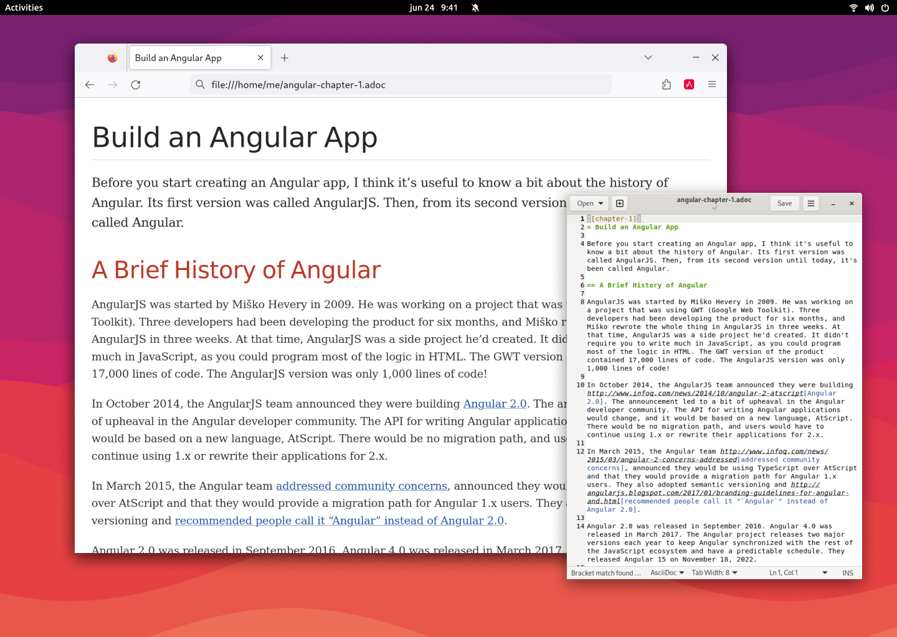

= Asciidoctor Browser Extension
Guillaume Grossetie
// Settings
:table-frame: none
:table-grid: none
:table-stripes: none
:experimental:
:figure-caption!:
:example-caption!:
// GitHub specific settings
ifndef::env-github[:icons: font]
ifdef::env-github[]
:caution-caption: :fire:
:important-caption: :exclamation:
:note-caption: :information_source:
:tip-caption: :bulb:
:warning-caption: :warning:
endif::[]
:chromium-browser-list: Chrome, Edge, Chromium, Brave or Opera
:project-name: Asciidoctor Browser Extension
:url-asciidoc: https://asciidoc.org
:url-asciidoctor-js-repo: https://github.com/asciidoctor/asciidoctor.js
:url-project-repo: https://github.com/asciidoctor/asciidoctor-browser-extension
:url-license: https://github.com/asciidoctor/asciidoctor-chrome-extension/blob/main/LICENSE
// Webstores
:url-chrome-webstore: https://chrome.google.com/webstore/detail/asciidoctorjs-live-previe/iaalpfgpbocpdfblpnhhgllgbdbchmia
:url-mozilla-addon: https://addons.mozilla.org/firefox/addon/asciidoctorjs-live-preview
:url-opera-addon: https://addons.opera.com/extensions/details/asciidoctorjs-live-preview
:url-edge-webstore: https://microsoftedge.microsoft.com/addons/detail/asciidoctorjs-live-previ/pefkelkanablhjdekgdahplkccnbdggd
// Graphics
:url-chrome-webstore-image: https://raw.githubusercontent.com/asciidoctor/asciidoctor-browser-extension/main/promotional/chromewebstore-badge-wborder-496x150.png
:url-mozilla-addon-image: https://blog.mozilla.org/addons/files/2020/04/get-the-addon-fx-apr-2020.svg
:url-opera-addon-image: https://dev.opera.com/extensions/branding-guidelines/addons_206x58_en@2x.png
:url-edge-webstore-image: https://raw.githubusercontent.com/asciidoctor/asciidoctor-browser-extension/main/promotional/edgewebstore-badge.png

Enjoy AsciiDoc everywhere your browser goes with the {project-name}.

The {project-name} uses {url-asciidoctor-js-repo}[Asciidoctor.js] 
to preview {url-asciidoc}[AsciiDoc] files (.ad, .adoc, .asc, .asciidoc, and optionally .txt)
as HTML inside Chrome, Brave, Firefox, Opera, Microsoft Edge and other Chromium browsers.

*Project health:* image:https://github.com/asciidoctor/asciidoctor-browser-extension/workflows/CI/badge.svg[Build Status, link="https://github.com/asciidoctor/asciidoctor-browser-extension/actions?query=workflow%3ACI"]

== Install

. Install the Extension on your browser using the image links below.
+
[%autowidth,cols=4*a]
|===
|[caption=]
.Chrome
image::{url-chrome-webstore-image}["Image link to the extension in the Chrome webstore.",212,64,link={url-chrome-webstore}]

|[caption=]
.Firefox
image::{url-mozilla-addon-image}[Image link to the extension in the Firefox webstore,184,64,link={url-mozilla-addon}]

|[caption=]
.Opera
image::{url-opera-addon-image}[Image link to the extension in the Opera webstore,227,64,link={url-opera-addon}]

|[caption=]
.Edge
image::{url-edge-webstore-image}[Image link to the extension in the Microsoft Edge webstore,177,64,link={url-edge-webstore}]
|===
+
TIP: You can also search your browser's Web Store for the Asciidoctor.js Live Preview extension.

. To preview local files on {chromium-browser-list} browsers,
you need to grant filesystem access to the extension:
+
--
.. Type the URL `chrome://extensions` into the address bar and press kbd:[Enter]
.. Type `asciidoctor` into the extension search bar then when the {project-name} block is visible, click its btn:[Details] button 
.. Check `Allow access to file URLs`
+
NOTE: If the plugin does not view a local file, check the above setting.
--

. You have now installed the extension, and can open local or remote *.adoc*, *.ad*, *.asc*, *.asciidoc* files in your browser
+
Enjoy!

== Next steps

If you want to learn more and explore the capabilities of the Extension, please read the https://docs.asciidoctor.org/browser-extension[User Manual].

== Contributing

See the xref:CONTRIBUTING.adoc[] file.

== Changelog

See the xref:changelog.adoc[] file.

== Copyright

Copyright (C) 2013-{docyear} Guillaume Grossetie.
Free use of this software is granted under the terms of the MIT License.

See the {url-license}[LICENSE] file for details.
